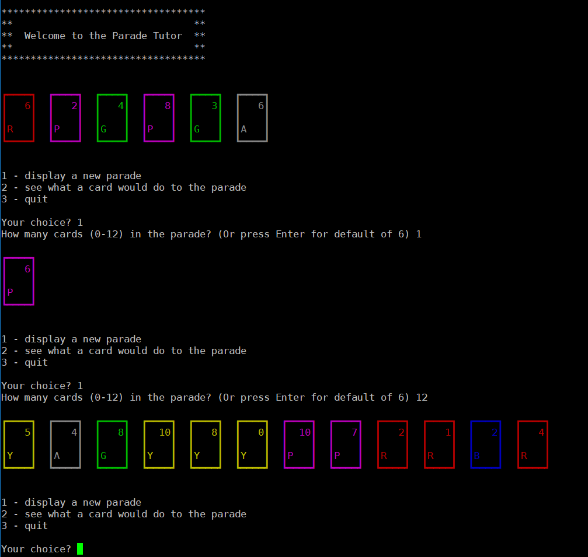
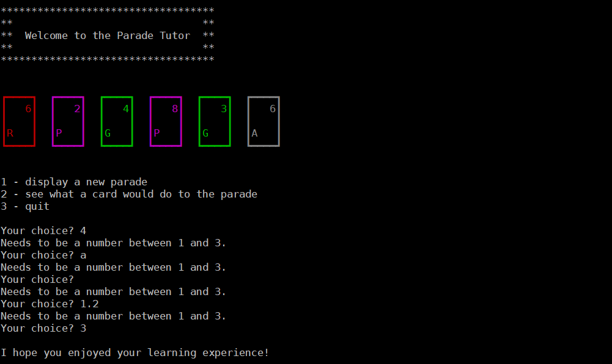
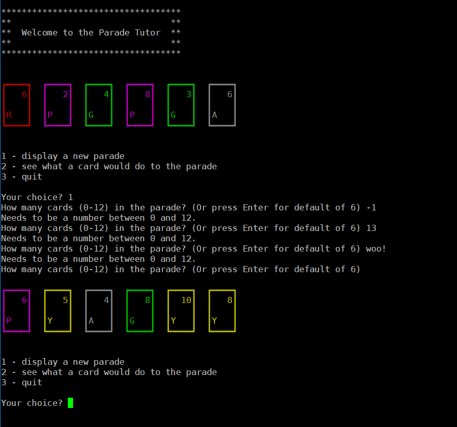
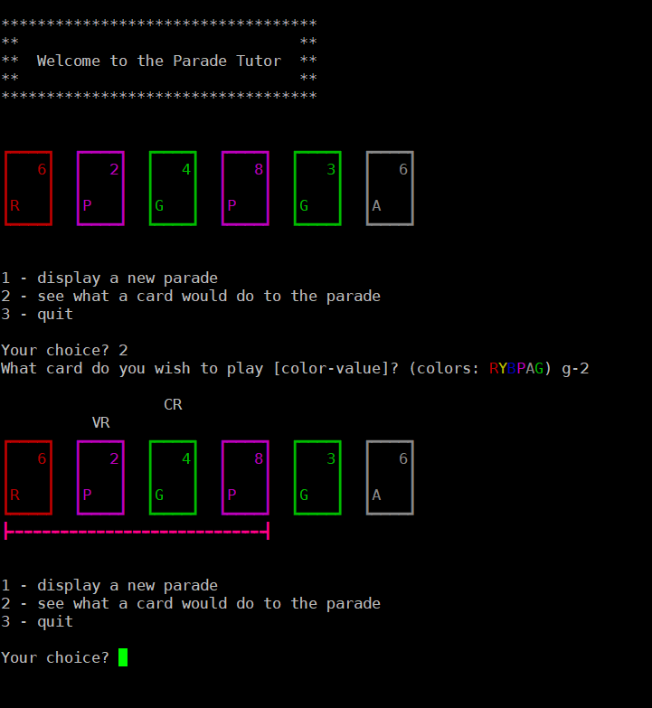
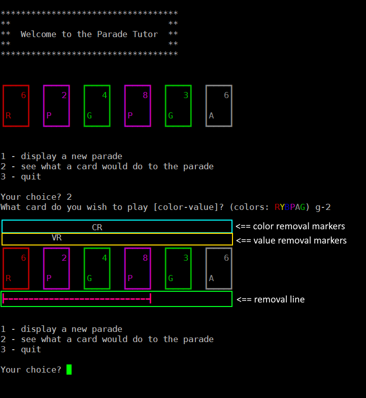
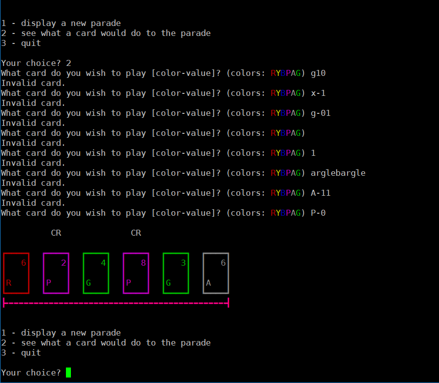

# Assignment 04

## Challenge: Parade Card Game Simulator

### Preamble

[Parade](https://www.zmangames.com/en/products/parade/) is an odd card game by Naoki Homma and is distributed by Z-Man games in North America. One of the more interesting things about this game is the "parade" itself: a line of cards that the players add to during their turn.

When a player adds a card to the parade, a number of things have to happen, based on small set of rules. This part of the game can be quite confusing to new players.

You should read the parts about adding to a parade on pages 2 and 3 of the instructions. (They are included in this Github repo.)

### What you're going to build

In this assignment, you will create an app that will explain to the user what happens when a given card is added to a given parade.

There are quite a few helper classes I've provided for you. Documentation and usage examples for each one are provided later. Not reading these would be A Bad Idea of Epic Proportions.

Some example runs follow.

**Example Run 1:**

> Commentary on Run 1
>
> After starting the app, you can see the following things:
>
> - a welcome banner (you can make this look however you like)
> - a series of colored boxes representing the cards in the starting parade (which always has 6 cards). Each card has its value (from 0 to 10) in the top right corner and a character representing its color in the bottom left corner. You will need to use methods from the `ParadeDisplayHelper` to show this.
> - a menu that gives you 3 choices. Your menu must have the same choices in the same order.
> - a prompt ('Your choice? ')
>
> In this particular example, we see that the user chose to quit and was given a cheesy parting message. You can change the message, but there should be one.

---

**Example Run 2:**

> Commentary on Run 2
>
> Here we explore the first menu item a bit with some "normal" valid input:
>
> - the first time, we ask for a parade of size 1 and we get a parade of size 1 back
> - the menu comes back again (_do I sense a loop?!?_) and this time we choose a parade of size 12
> - that darn menu is back again
>
> Did you notice something about the series of cards that came up when the program started? Yep - they're the same! That's because the "deck" that your program will be drawing cards from always returns the same sequence of cards. In real life, you'd obviously want something more random, but for the purposes of automated testing (and for your own coding sanity as well!), this is perfect.

---

**Example Run 3:**

> Commentary on Run 3
>
> Here we see what happens with invalid input at the main menu. Notice that the main menu only accepts the numbers 1 through 3. Anything else (numbers out of range, letters, blank entries, doubles) all print a warning and then re-prompt.

---

**Example Run 4:**

> Commentary on Run 4
>
> Here we see what happens with invalid input at menu option 1. Notice that this menu only accepts the numbers 0 through 12 or an immediate press of the Enter key. Anything else (numbers out of range, letters, doubles) all print a warning and then re-prompt.

---

**Example Run 5**

Here is a marked up version of the previous screenshot - we'll use this one for the commentary.

> Commentary on Run 5
>
> This run shows what happens when menu option 2 is displayed:
>
> - first, the user is prompted for the card they wish to play. The user will have to type in their response in `[color-value]` format, case-insensitive. (So Y-2, g-4, a-0 would all be valid entries. We'll see what happens with invalid entries in the next run.) You can prompt any way you wish, but you should be kind to your user.
> - next, the user is shown what cards would be removed from the parade if their chosen card was played, according to the rules of the game. You **did** look over that part of the rules, right?
>
> Let's break down what we're seeing in more detail.
>
> - there is a **removal line** underneath the cards, showing which cards are eligible for removal. Let's call this the **removal zone**. (In the current example, because a card with a value of 2 was played, the first **two** cards on the right are safe, but the remaining cards are eligible for removal.)
> - if any card would be removed from the parade because its color matches the played card, a `CR` is placed above the card two rows above the card display. (In the given sample, there is a CR above the G-4 card because the card we played was **green** and the G-4 is also **green** and in the removal zone.)
> - if any card would be removed from the parade because its value is less than or equal to the played card, a `VR` is placed above the card two rows above the card display. (In the given sample, there is a VR above the P-2 card because the card we played has a value of **2** and the P-2 card's value is less than or equal to that and in the removal zone.)

---

**Example Run 6:**

> Commentary on Run 6
>
> Here we see what happens with invalid input in menu option 2. Notice that this menu expects a card in the `[color-value]` format shown in Run 5. Allowable colors are the letters R, Y, B, P, A, and G (all case-insensitive). Allowable values are 0 through 10. Let's talk about the given sample inputs in more detail:
>
> - g10 is rejected because it doesn't have a dash
> - x-1 is rejected because x is an invalid color
> - g-01 is rejected because 01 isn't a valid number (though 1 by itself is)
> - a blank entry is rejected
> - a valid value by itself is rejected
> - arglebargle is just wrong
> - A-11 is rejected because 11 is out of allowable range
>
> You don't have to tell the user what is specifically wrong with the input here - I figure you have enough on your plate. If you **want** to provide more useful error messages here, feel free to do so - it's good practice, but potentially time (and energy) consuming!
>
> (Just a side note: you should be able to explain why the valid card (P-0) results in the display that you see....)

### Notes
